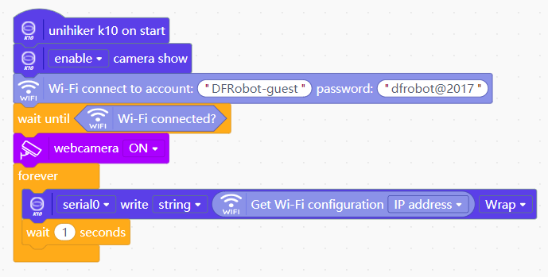
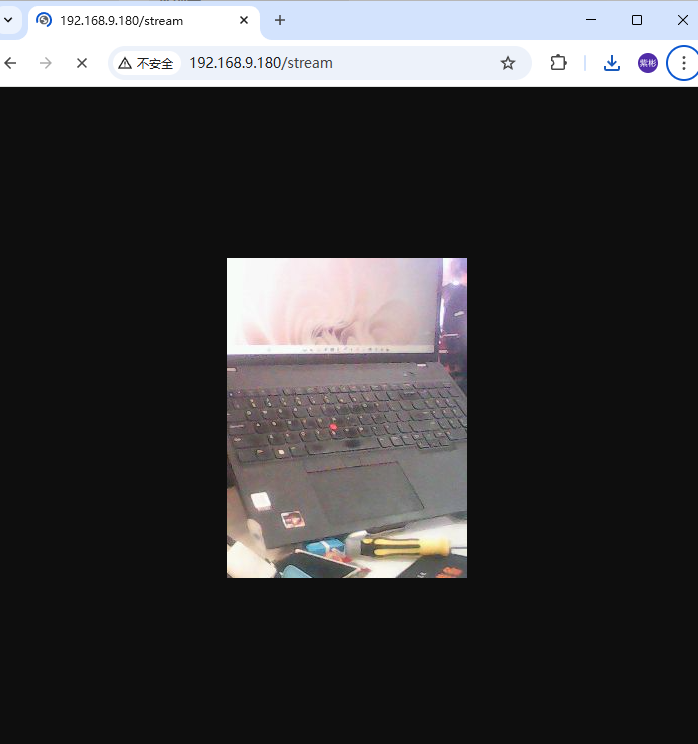

# K10webcam
* [中文](./README_CN.md)
Airline Board K10 Webcam Library, after connecting to WiFi and turning on the webcam, other devices in the network can view the camera screen by connecting to the IP/stream of the Airline Board K10.
It needs to be used with WiFi library.

# Blocks

# Example
After uploading the program, open the serial port to see the IP address of the K10.

 
Input the IP address/stream to view the camera's shooting screen in real time. After uploading the program, you can open the serial port to see the K10's IP address.

# Compatible list
|Board|Online mode|ArduinoC|MicroPython|python|Note|
|-----|-----|-----|-----|:-----:|-----|
|uno||||||
|micro:bit||||||
|mpython||||||
|arduinonano||||||
|leonardo||||||
|mega2560||||||
|行空板K10||√||||

# Update log
V0.0.1 Complete basic function
V0.0.2 Add English