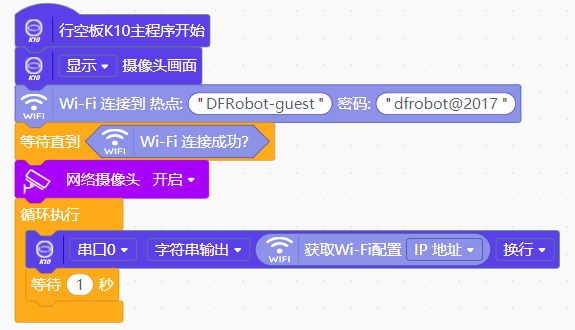

# K10webcam
* [English](./README.md)
行空板K10网络摄像头库，连接WiFi并开启网络摄像头后，网络内其他设备可通过连接行空板K10的IP/stream查看摄像头画面。
需要配合WiFi库使用。

# 积木

# 程序实例
上传程序后打开串口可看到K10的IP地址

 
输入IP地址/stream可实时查看摄像头拍摄画面

# 支持列表
|主板型号|实时模式|ArduinoC|MicroPython|python|备注|
|-----|-----|-----|-----|:-----:|-----|
|uno||||||
|micro:bit||||||
|mpython||||||
|arduinonano||||||
|leonardo||||||
|mega2560||||||
|行空板K10||√||||

# 更新日志
V0.0.1 基础功能完成
V0.0.2 增加英文翻译